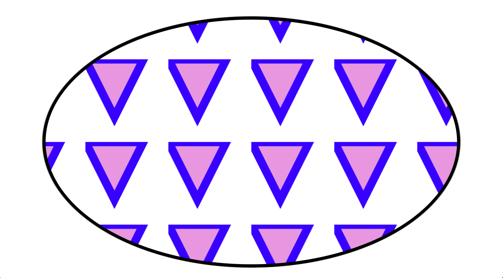
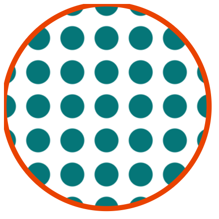
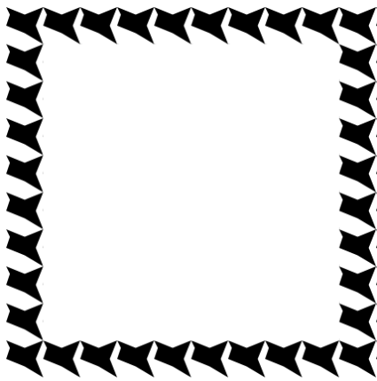

Scalable Vector Graphic (SVGs) can be used for web development and data visualization. It is mainly used to create vector based images. SVG draws lines at different coordinates on the screen to create the image. A powerful SVG element is pattern! The many uses and features of the pattern element are described below.

### Example 1
The pattern element defines a graphics object which can be redrawn at repeated x and y coordinate intervals ("tiled") to cover an area.

    <svg xmlns="http://www.w3.org/2000/svg"
         version="1.1"
         viewBox="0 0 300 200" >

      <title>Example pattern01</title>
      <desc>Fill an ellipse using a pattern paint server.</desc>

      <defs>
        <pattern id="TrianglePattern"
             patternUnits="userSpaceOnUse"
                 x="0" y="0" width="50" height="50"
                 viewBox="0 0 10 10" >
          <path d="M 0 0 L 7 0 L 3.5 7 z"
              fill="#fdcb6e"
              stroke="#e84393" />
        </pattern>
      </defs>

      <!-- The ellipse is filled using a triangle pattern paint server -->
      <ellipse fill="url(#TrianglePattern)"
           stroke="black"
           stroke-width="2"
               cx="150" cy="100" rx="125" ry="75" />
    </svg>

The `<ellipse>` element is an SVG basic shape, used to create
ellipses based on a center coordinate, and both their x and y radius. The ellipse is filled using a triangle pattern paint server.

----
#### Features
1. [<defs>](https://developer.mozilla.org/en-US/docs/Web/SVG/Element/defs):
    - The `<defs>` element is used to store graphical objects that will be used at a later time.

    <defs>
      <pattern id="TrianglePattern"
           patternUnits="userSpaceOnUse"
               x="0" y="0" width="50" height="50"
               viewBox="0 0 10 10" >
        <path d="M 0 0 L 7 0 L 3.5 7 z"
            fill="#fdcb6e"
            stroke="#e84393" />
      </pattern>
    </defs>

2. [<pattern>](https://developer.mozilla.org/en-US/docs/Web/SVG/Element/pattern):
    - The `<pattern>` element is a fill type to use in SVG.

    <pattern id="TrianglePattern"
         patternUnits="userSpaceOnUse"
             x="0" y="0" width="50" height="50"
             viewBox="0 0 10 10" >
      <path d="M 0 0 L 7 0 L 3.5 7 z"
          fill="#fdcb6e"
          stroke="#e84393" />
    </pattern>

3. [patternUnits](https://developer.mozilla.org/en-US/docs/Web/SVG/Attribute/patternUnits):
    - The `patternUnits` attribute indicates which coordinate system to use for the geometry properties of the <pattern> element.

    <pattern id="TrianglePattern"
         patternUnits="userSpaceOnUse"
             x="0" y="0" width="50" height="50"
             viewBox="0 0 10 10" >
      <path d="M 0 0 L 7 0 L 3.5 7 z"
          fill="#fdcb6e"
          stroke="#e84393" />
    </pattern>

4. [x](https://developer.mozilla.org/en-US/docs/Web/SVG/Attribute/x):
    - This attribute determines the x coordinate shift
    of the pattern tile. This x attribute defines a x-axis
    coordinate in the user coordinate system.

    <pattern id="TrianglePattern"
         patternUnits="userSpaceOnUse"
             x="0" y="0" width="50" height="50"
             viewBox="0 0 10 10" >
      <path d="M 0 0 L 7 0 L 3.5 7 z"
          fill="#fdcb6e"
          stroke="#e84393" />
    </pattern>

5. [y](https://developer.mozilla.org/en-US/docs/Web/SVG/Attribute/y):
    - This attribute determines the y coordinate shift
    of the pattern tile. The y attribute defines a y-axis
    coordinate in the user coordinate system.

    <pattern id="TrianglePattern"
         patternUnits="userSpaceOnUse"
             x="0" y="0" width="50" height="50"
             viewBox="0 0 10 10" >
      <path d="M 0 0 L 7 0 L 3.5 7 z"
          fill="#fdcb6e"
          stroke="#e84393" />
    </pattern>
6. [width](https://developer.mozilla.org/en-US/docs/Web/SVG/Attribute/width):
    - This attribute determines the width of the
    pattern tile.

    <pattern id="TrianglePattern"
         patternUnits="userSpaceOnUse"
             x="0" y="0" width="50" height="50"
             viewBox="0 0 10 10" >
      <path d="M 0 0 L 7 0 L 3.5 7 z"
          fill="#fdcb6e"
          stroke="#e84393" />
    </pattern>
7. [height](https://developer.mozilla.org/en-US/docs/Web/SVG/Attribute/width):
    - This attribute determines the height of the
    pattern tile.

    <pattern id="TrianglePattern"
         patternUnits="userSpaceOnUse"
             x="0" y="0" width="50" height="50"
             viewBox="0 0 10 10" >
      <path d="M 0 0 L 7 0 L 3.5 7 z"
          fill="#fdcb6e"
          stroke="#e84393" />
    </pattern>
8. [viewBox](https://developer.mozilla.org/en-US/docs/Web/SVG/Attribute/viewBox):
    - This attribute defines the bound of the SVG
     viewport for the pattern fragment. The viewBox Attribute
     defines the position and dimension, in user space, of
     an SVG viewport.

     <pattern id="TrianglePattern"
          patternUnits="userSpaceOnUse"
              x="0" y="0" width="50" height="50"
              viewBox="0 0 10 10" >
       <path d="M 0 0 L 7 0 L 3.5 7 z"
           fill="#fdcb6e"
           stroke="#e84393" />
     </pattern>

9. [`<path>`](https://developer.mozilla.org/en-US/docs/Web/SVG/Tutorial/Paths):
    - The `<path>` element is the most powerful element in
    the SVG library of basic shapes. You can use it to create
    lines, curves, arcs and more. Paths create complex shapes
    by combining multiple straight lines or curved lines.

    <pattern id="TrianglePattern"
         patternUnits="userSpaceOnUse"
             x="0" y="0" width="50" height="50"
             viewBox="0 0 10 10" >
      <path d="M 0 0 L 7 0 L 3.5 7 z"
          fill="#fdcb6e"
          stroke="#e84393" />
    </pattern>

10. [d](https://developer.mozilla.org/en-US/docs/Web/SVG/Attribute/d):
    - The `d` attribute defines the shape of the path element. The d attribute contains a series of commands and parameters used by those commands. Each of commands is instantiated (for example, creating a class, naming and locating it) by a specific letter. For instance, let's move to the x and y coordinates (10, 10). The "Move to" command is called with the letter M. When the parser runs into this letter, it knows you want to move to a point.

    <pattern id="TrianglePattern"
         patternUnits="userSpaceOnUse"
             x="0" y="0" width="50" height="50"
             viewBox="0 0 10 10" >
      <path d="M 0 0 L 7 0 L 3.5 7 z"
          fill="#fdcb6e"
          stroke="#e84393" />
    </pattern>

11. [fill](https://developer.mozilla.org/en-US/docs/Web/SVG/Tutorial/Fills_and_Strokes):
    - The `fill` attribute sets the color inside the object

    <pattern id="TrianglePattern"
         patternUnits="userSpaceOnUse"
             x="0" y="0" width="50" height="50"
             viewBox="0 0 10 10" >
      <path d="M 0 0 L 7 0 L 3.5 7 z"
          fill="#fdcb6e"
          stroke="#e84393" />
    </pattern>
12. [stroke](https://developer.mozilla.org/en-US/docs/Web/SVG/Tutorial/Fills_and_Strokes)
    - The `stroke` sets the color of the line drawn
    around the object. You can also specify the opacity
    of either the fill or stroke separately in SVG. These
    are controlled by the fill-opacity and stroke-opacity
    attributes.

    <pattern id="TrianglePattern"
         patternUnits="userSpaceOnUse"
             x="0" y="0" width="50" height="50"
             viewBox="0 0 10 10" >
      <path d="M 0 0 L 7 0 L 3.5 7 z"
          fill="#fdcb6e"
          stroke="#e84393" />
    </pattern>

### Example 2
Most of the time a pattern is filling a shape. To
accomplish is in the SVG element with give the shape a style property fill
that is referencing the pattern defined above it.

    <svg
        viewBox="0 0 300 200">
        <defs>
            <pattern id="myPattern"
                     x="10" y="10" width="20" height="20"
                     patternUnits="userSpaceOnUse">
                     <!--start pattern-->
                     <circle cx="10" cy="10" r="7" style="stroke: none;
                     fill: #307476"/>
                    <!-- end pattern -->
            </pattern>
        </defs>
        <circle cx="60" cy="60" r="60" style="stroke: #DA502A; stroke-width: 3px; fill:url(#myPattern);" />
    </svg>

### Example 3
The is not only used to fill circular shapes, but
other basic shapes as well such as a line, polygons, rectangles, and polylines.

    <svg viewBox="0 0 230 100" xmlns="http://www.w3.org/2000/svg">
      <defs>
        <pattern id="star" viewBox="0,0,10,10" width="10%" height="10%">
          <polygon points="0,0 1,2 0,5 5,7 10,10 8,5 10,0 5,2"/>
        </pattern>
      </defs>
      <rect width="100" height="100" fill="none" stroke-width="20" stroke="url(#star)"/>
    </svg>

#### Uses
The SVG Pattern element can used for data visualization software, particularly
graphs and diagrams. For instance, the Github daily commit tracker on a users profile
uses the SVG pattern element.

SVG allows you build up complex, layered patterns.

Furthermore there is software that generates SVG patterns and that you can use and get the code from such as  [Hero Pattern](http://www.heropatterns.com/) and [SVG Patterns Gallery](https://philiprogers.com/svgpatterns/).

## Browser Support
The SVG pattern element has basic support from most browsers.
- Chrome
- Edge
- Firefox
- IE
- Opera
- Safari
- WebView Android
- Chrome Android
- Edge Mobile
- Firefox Android
- Opera Android
- Safari iOS

However valuable pattern element attributes such `patternUnits`, `patternContentUnits`, and `patternTransform` are only supported by Safari.

## Documentation
- https://developer.mozilla.org/en-US/docs/Web/SVG/Tutorial/Patterns

## Other Resources
- http://vanseodesign.com/web-design/svg-basics/
- https://www.sitepoint.com/6-incredible-svg-pattern-generators/
